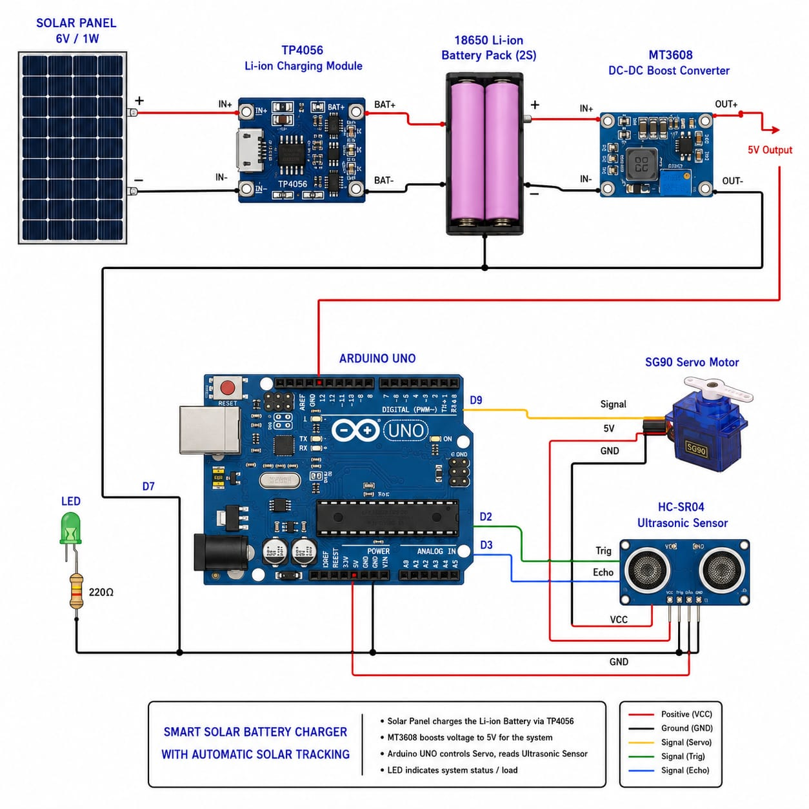
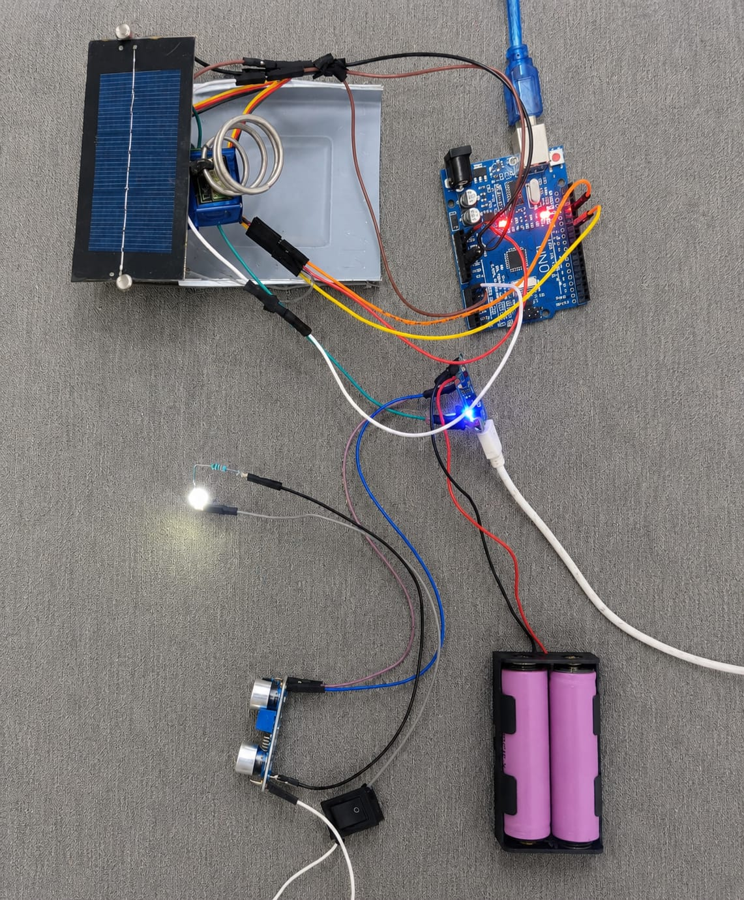

# Solar Battery Charger with Automatic Solar Tracking

## Overview

This project presents an Arduino-based solar battery charging system with automatic solar tracking. The system uses two Light Dependent Resistor (LDR) sensors to detect the direction of maximum sunlight and automatically rotates the solar panel using a servo motor. By continuously aligning the panel with the strongest light source, the system improves solar energy harvesting and battery charging efficiency.

This project was developed collaboratively by a team of four members as part of an academic project.

## Features

- Automatic solar tracking using dual LDR sensors
- Servo motor-based panel positioning
- Arduino Uno-based control system
- Improved solar energy harvesting
- Low-cost and energy-efficient design
- Easy to implement and maintain

## Components Required

### Hardware

- Arduino Uno
- Solar Panel
- Servo Motor (SG90)
- Rechargeable Battery
- Breadboard

### Sensors

- 2 × Light Dependent Resistors (LDRs)

### Passive Components

- 2 × 10 kΩ Resistors

### Accessories

- Jumper Wires

## Working Principle

1. Two LDR sensors continuously measure sunlight intensity.
2. The Arduino compares the readings from both sensors.
3. The servo motor rotates the solar panel toward the sensor receiving higher light intensity.
4. The process repeats continuously, ensuring the panel remains aligned with the strongest light source.
5. The optimized panel orientation improves battery charging efficiency.

## Circuit Diagram



## Project Output



## Software Used

- Arduino IDE
- Embedded C
- Git
- GitHub

## Installation

1. Clone the repository.

```bash
git clone https://github.com/dhayas06/Solar-Battery-Charger-with-Automatic-Solar-Tracking.git
```

2. Open `Code/solar_battery_charger.ino` using the Arduino IDE.
3. Connect the Arduino Uno to your computer.
4. Select the appropriate board and COM port.
5. Upload the program to the Arduino.
6. Power the circuit and observe the automatic solar tracking system.

## Applications

- Solar energy systems
- Renewable energy projects
- Smart battery charging systems
- Embedded systems projects
- Engineering academic projects
- Educational demonstrations

## Future Enhancements

- Dual-axis solar tracking
- IoT-based remote monitoring
- Battery voltage and current monitoring
- Cloud-based data logging
- Mobile application integration

## Team

This project was developed collaboratively by:

- Dhayanidhi S – [@dhayas06](https://github.com/dhayas06)
- Hemaraj N – [@Hemaraj0515](https://github.com/Hemaraj0515)
- Dharani B – [@dharaniboominathan21-ctrl](https://github.com/dharaniboominathan21-ctrl)
- Dharunikaa M – [@Dharunikaa_2609](https://github.com/Dharunikaa_2609)

## License

This project is licensed under the MIT License.
